<h1 align="center">GNOMAC</h1>

<p align="center">
  Le ressenti de <b>macOS 27 « Golden Gate »</b> sur <b>GNOME 50+</b> : Liquid Glass, dock à ressorts,<br>
  encoche façon Dynamic Island, widgets éditables, Spotlight, Stage Manager, écrans de démarrage et de connexion.
</p>

<p align="center">
  
  
  
  
</p>

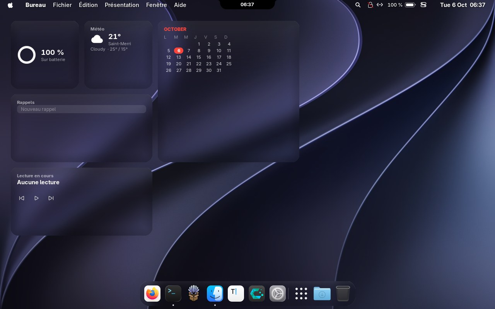

GNOMAC est **une seule extension GNOME Shell cohérente**, au lieu d'un empilement d'extensions qui se marchent dessus, plus un thème GTK pour les boutons de fenêtre et des installeurs propres. Il fonctionne sur GNOME, **pas besoin de Hyprland**.

> **Statut : v0.1, en développement.** Écrit et testé sur GNOME 50.5 (CachyOS, Wayland). Les captures de ce dépôt viennent d'une machine virtuelle sans accélération 3D : sur une vraie machine, les animations sont plus fluides.

---

## Sommaire

- [Installation en une ligne](#installation-en-une-ligne)
- [Désinstallation](#désinstallation)
- [Aperçu](#aperçu)
- [Toutes les fonctions](#toutes-les-fonctions)
- [Guide : raccourcis et gestes](#guide--raccourcis-et-gestes)
- [Installation pas à pas et options](#installation-pas-à-pas-et-options)
- [Écran de démarrage (Plymouth)](#écran-de-démarrage-plymouth)
- [Écran de connexion (GDM)](#écran-de-connexion-gdm)
- [Réglages](#réglages)
- [Limites connues](#limites-connues)
- [Développement](#développement)
- [Crédits et licence](#crédits-et-licence)

---

## Installation en une ligne

Sur CachyOS, Arch ou toute distribution avec **GNOME 50 ou plus** :

```bash
curl -fsSL https://raw.githubusercontent.com/Nayzer974/GNOMAC/main/get.sh | bash
```

Le script télécharge GNOMAC dans `~/.local/share/gnomac-src` et lance l'installeur. **Aucun `sudo`** n'est utilisé, sauf si tu demandes `--deps`. Quand c'est fini, **déconnecte-toi puis reconnecte-toi** : Wayland ne peut pas recharger le shell à chaud.

Avec les paquets, les extensions complémentaires, les icônes et les curseurs macOS :

```bash
curl -fsSL https://raw.githubusercontent.com/Nayzer974/GNOMAC/main/get.sh | bash -s -- --all
```

Tu préfères lire avant d'exécuter ? C'est un clone Git classique :

```bash
git clone https://github.com/Nayzer974/GNOMAC.git
cd GNOMAC
./install.sh
```

### Ce que fait l'installeur, sans surprise

1. **Enregistre tes réglages actuels** dans `~/.config/gnomac/backup.json` (avant toute modification).
2. Copie l'extension dans `~/.local/share/gnome-shell/extensions/` et l'active.
3. Installe les boutons de fenêtre « feux tricolores » pour GTK 3 et GTK 4 (`~/.config/gtk-*/gnomac.css`).
4. Place les boutons de fenêtre à gauche et, si la police **Inter** est installée, l'utilise.
5. Désactive les autres docks (Dash to Dock, Ubuntu Dock…) qui se battent pour le même bord d'écran. Il le note pour pouvoir les remettre.

Rien n'est installé pour tout le système sans que tu le demandes : le démarrage animé et l'écran de connexion sont des **commandes `sudo` que tu lances toi-même**.

---

## Désinstallation

```bash
~/.local/share/gnomac-src/uninstall.sh
```

(ou `./uninstall.sh` depuis le dossier cloné). GNOME retrouve **le look qu'il avait avant l'installation** :

| Remis comme avant | Comment |
|---|---|
| L'extension et tous ses réglages | supprimée, réglages `org.gnome.shell.extensions.gnomac` effacés |
| Boutons de fenêtre, polices, thème d'icônes et de curseurs, mode clair/sombre, couleur d'accentuation, raccourci de changement de clavier | restaurés aux **valeurs enregistrées à l'installation** (une clé qui n'avait jamais été modifiée est remise par défaut) |
| Le style GTK des fenêtres | import retiré, `gnomac.css` supprimé |
| Les docks désactivés par l'installeur | réactivés |
| Les extensions que tu as activées depuis | **conservées** |

Les extensions installées avec `--extras`, les thèmes d'icônes et de curseurs restent sur le disque (seuls les réglages qui pointaient dessus sont rétablis). Les deux éléments système, qui demandent `sudo`, sont retirés par une commande affichée à la fin :

```bash
sudo ./gdm/install-gdm.sh --remove                       # écran de connexion
sudo plymouth-set-default-theme -R cachyos && sudo rm -rf /usr/share/plymouth/themes/gnomac   # démarrage
```

Déconnecte-toi puis reconnecte-toi pour finir.

---

## Aperçu

### Encoche : un tableau de bord qui se déplie

Une encoche noire collée au bord haut, avec raccords concaves, qui s'élargit selon ce qui se passe (musique, minuteur, notifications, volume). Au survol, six onglets : **Accueil**, **Système**, **Actions rapides**, **Presse-papiers**, **Minuteur Pomodoro**, **Étagère**. Les pastilles prennent la palette de couleurs de macOS (Wi-Fi et Bluetooth en bleu, Concentration en violet, Lumière nocturne en orange) avec des fondus et des rebonds à chaque clic.

| Accueil | Système |
|---|---|
| 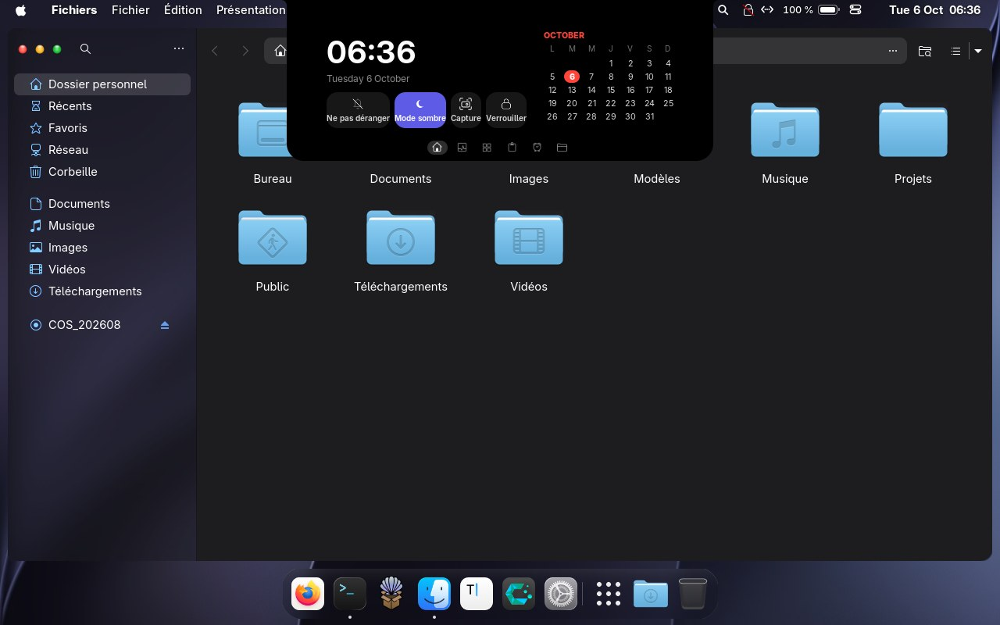 |  |
| **Actions rapides** | **Minuteur Pomodoro** |
|  |  |

### Personnaliser l'encoche

Préférences (`gnome-extensions prefs gnomac@nayzer974.github.io`) › **Dynamic Island**, avec une douzaine de réglages en direct :

| Réglage | Choix |
|---|---|
| **Ouverture du tableau de bord** | survol et clic, survol seul, clic seul, ou jamais (l'encoche ne sert alors qu'aux notifications, au volume et au minuteur) |
| **Encoche repliée** | toujours visible, visible seulement s'il se passe quelque chose, ou **invisible** jusqu'au survol ou au clic |
| **Taille** | de 0,9 à 1,5 |
| **Délais** | avant l'ouverture au survol, avant la fermeture, fermeture automatique après un clic |
| **Contenu replié** | heure (24 h ou 12 h), pochette et égaliseur, anneau du minuteur, pastille de notifications |
| **Volume et luminosité** | dans l'encoche ou l'affichage d'origine de GNOME, durée réglable |
| **Notifications** | dans l'encoche ou non, durée de 1 à 20 s |
| **Onglets** | chacun des six peut être retiré, onglet d'ouverture au choix, retour au dernier onglet utilisé |
| **Animations** | rebond à l'arrivée d'une notification, apparition du contenu élément par élément |
| **Plein écran** | masquer l'encoche devant une fenêtre en plein écran |

### Spotlight, Centre de contrôle, Launchpad

| Spotlight (`Super + Espace`) | Centre de contrôle et section **Apparence** |
|---|---|
| 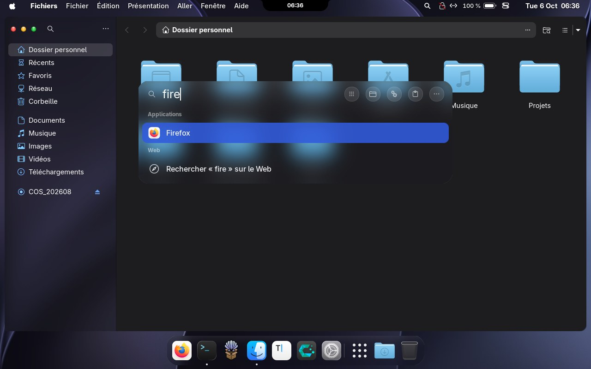 | 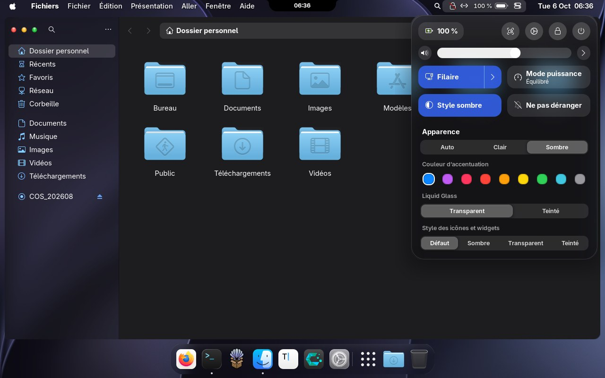 |
| **Launchpad** | **Centre de notifications** |
| 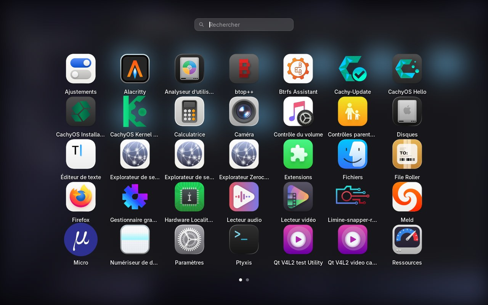 | 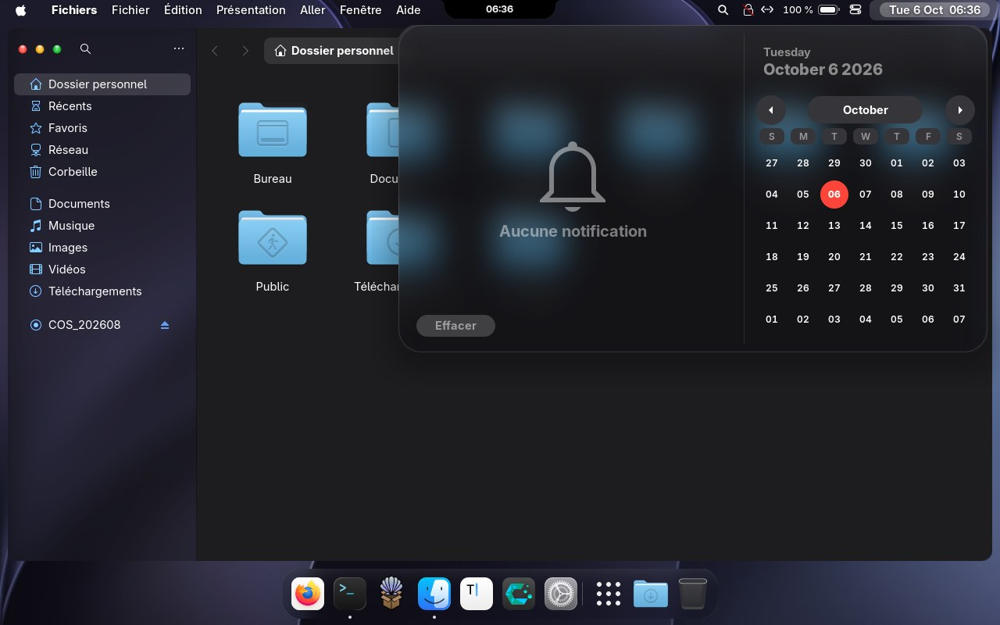 |

### Fenêtres : disposition et Stage Manager

| Palette de disposition (`Super + Ctrl + T`) | Deux moitiés d'écran |
|---|---|
| 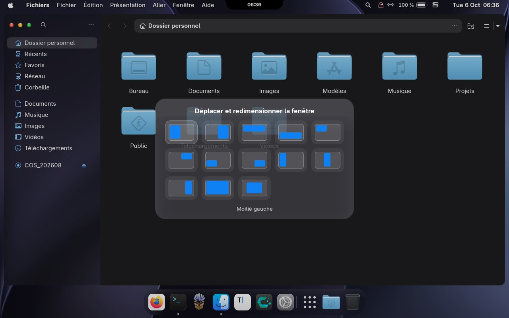 | 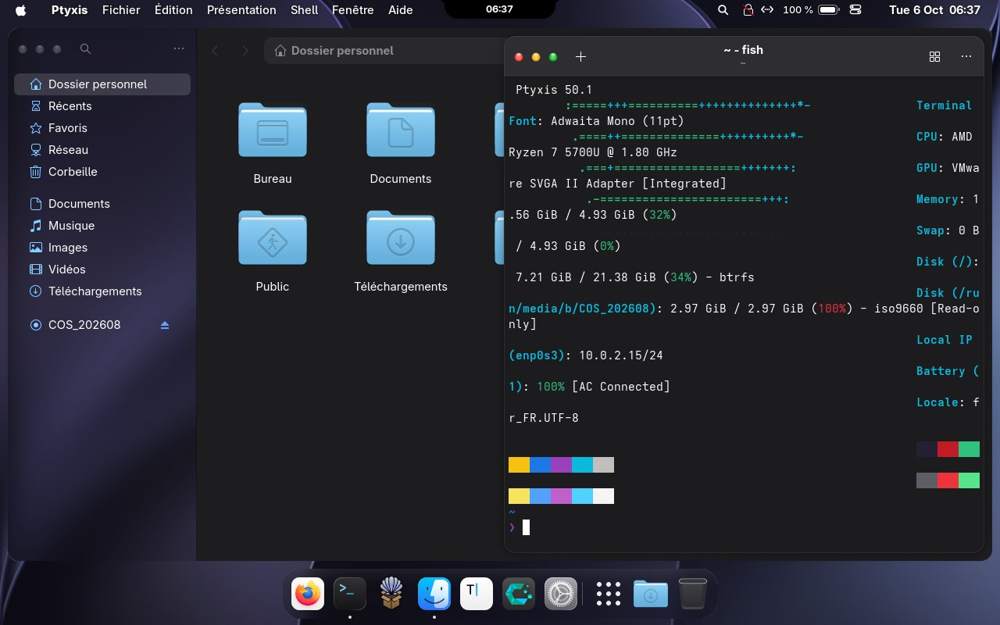 |
| **Stage Manager** (`Super + Ctrl + M`) | **Barre de capture d'écran** |
| 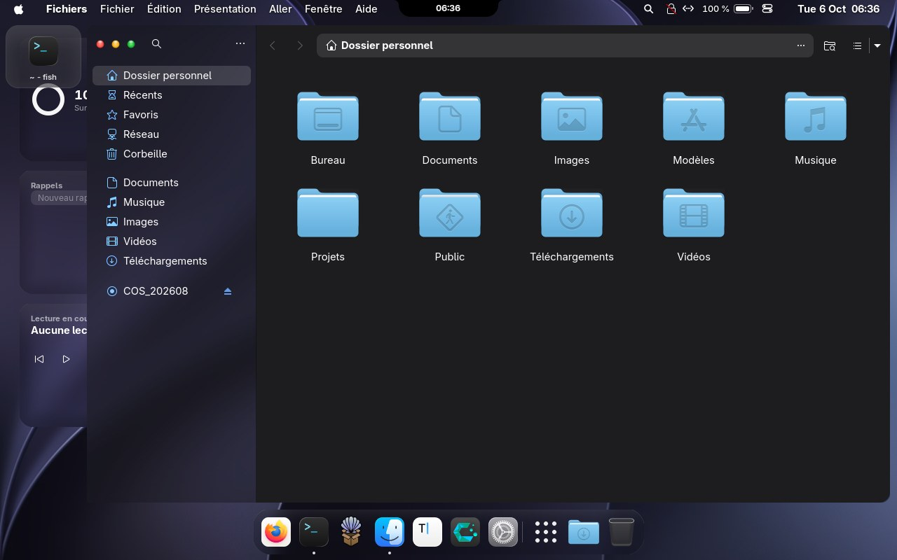 | 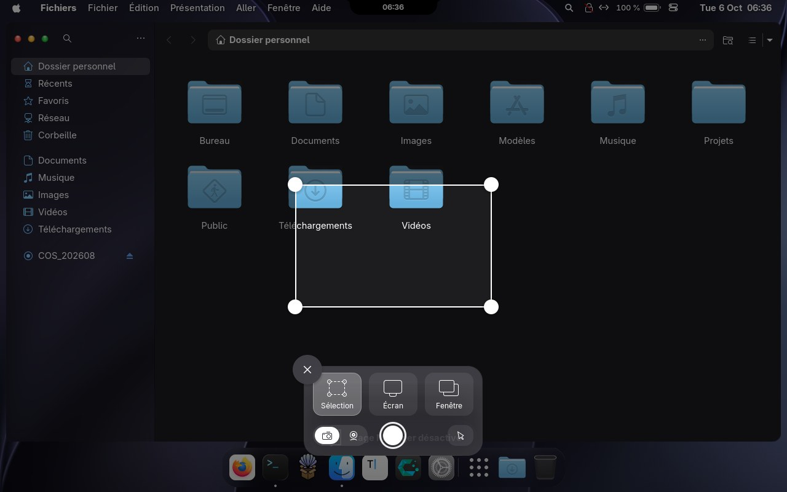 |

### Widgets éditables et guide intégré

| Modifier les widgets | Guide (tape « guide » dans Spotlight) |
|---|---|
| 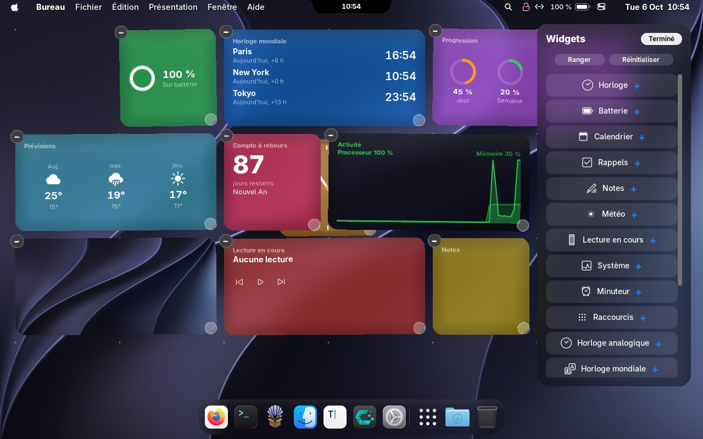 | 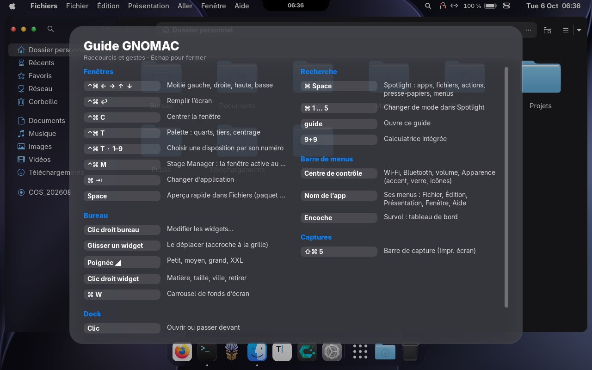 |

---

## Toutes les fonctions

### Apparence

| Élément | Détail |
|---|---|
| **Liquid Glass** | Vraie réfraction : un shader GLSL courbe une copie floutée de ce qui est derrière (fenêtres comprises) près des bords arrondis, avec dispersion chromatique, éclairage du bord et reflet en haut. La lueur suit le pointeur et une ombre interne adoucit les surfaces. |
| **Liquid Glass réglable** | Curseur d'intensité, **transparent ou teinté** comme dans les Réglages de macOS 27, appliqués à tout le verre. |
| **Section Apparence** | Dans le Centre de contrôle : couleur d'accentuation (9 couleurs, GNOME), Auto / Clair / Sombre, verre transparent ou teinté, style des icônes (défaut, sombre, transparent, teinté). |
| **Menus en verre** | Tous les menus du shell (système, apps, dock, calendrier, Réglages rapides) reçoivent un fond Liquid Glass qui suit leur animation. Les Réglages rapides prennent l'allure du **Centre de contrôle** : tuiles arrondies, curseurs épais. |
| **Boutons de fenêtre** | Les « feux tricolores » brillants de Golden Gate, en GTK 3 et GTK 4/libadwaita, à gauche. |
| **Barre latérale Finder** | Dans Fichiers, un verre dépoli sous la barre latérale (la « vibrancy »), icônes teintées accent. Tout passe par un thème : aucun binaire injecté. |
| **Sélecteur d'apps, capture d'écran, Mission Control** | Restylés en verre : `Super + Tab`, barre de capture, vue d'ensemble. |

### Barre de menus

| Élément | Détail |
|---|---|
| **Menu système et pomme** | À propos, Réglages, App Store, Forcer à quitter, Suspendre, Redémarrer…, logo pomme ou pont Golden Gate. |
| **Menus de l'app active** | Nom de l'app en gras, puis Fichier, Édition, Présentation, Fenêtre, Aide. Les menus restent à l'écart de l'encoche. |
| **Symboles à droite** | Wi-Fi en éventail selon le signal (ou `<···>` en filaire), batterie horizontale avec pourcentage (verte en charge, rouge sous 20 %), pastille de Concentration, Centre de contrôle. Les indicateurs de confidentialité restent visibles. |
| **Icônes masquées** | Les icônes d'applications se replient derrière une flèche. |

### Dock

Flotte au-dessus du bas de l'écran, **un clic sur l'icône de l'app active la cache** (comme la barre des tâches de Windows ; un deuxième clic la ramène), **compteurs de notifications** (pastille rouge sur l'icône de l'app), **nuage de fumée** quand on retire une icône, **taille automatique** qui suit la hauteur de l'écran. Agrandissement en courbe gaussienne qui écarte les voisines, rebond au lancement, points sous les apps ouvertes, infobulles (« Tourne en arrière-plan »), glisser-déposer pour réorganiser, **pile Téléchargements** en éventail, **Corbeille** vide ou pleine. Une physique de ressorts commune garde toutes les animations naturelles.

### Encoche (Dynamic Island)

Pochette, égaliseur teinté par la musique, minuteur, notifications, volume et luminosité. Un **Pomodoro complet** (concentration, pauses courtes et longue, cycles, durées réglables). Une horloge et le calendrier quand rien ne joue. Un presse-papiers et une étagère de fichiers.

### Bureau

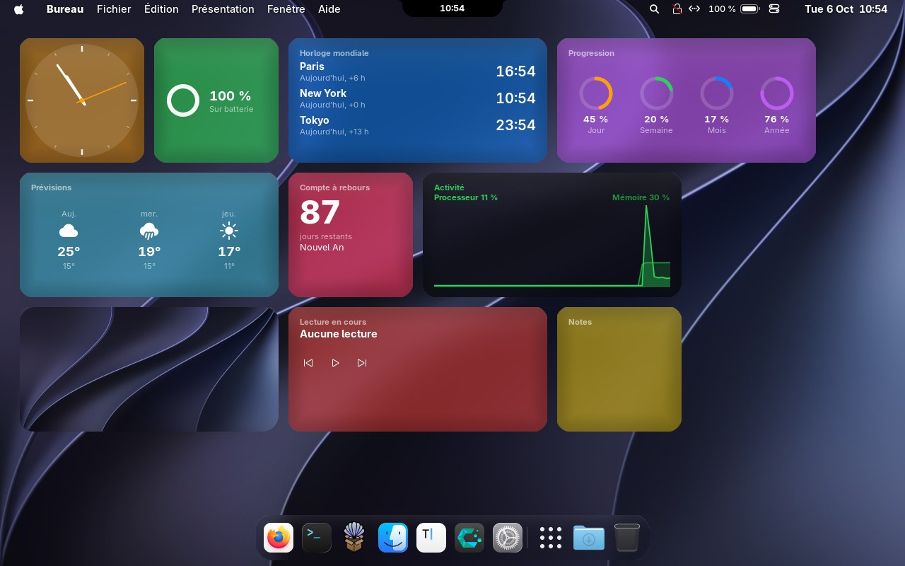

**Dix-sept types de widgets** : horloge, horloge analogique, horloge mondiale, batterie, calendrier, rappels, notes, météo, prévisions sur 3 jours, lecture en cours, système, activité (courbes processeur et mémoire en direct), minuteur, progression (jour, semaine, mois, année), compte à rebours, photo et raccourcis d'apps.

Clic droit sur le bureau › **Modifier les widgets…** :

- les tuiles frémissent au-dessus d'une **grille de points** ; le badge **−** retire, la poignée change la taille, la galerie ajoute ;
- en glissant, un **contour pointillé montre où le widget va atterrir** ; lâché sur une place occupée, il va à la place libre la plus proche ;
- **Ranger** réorganise tout le bureau, **Réinitialiser** remet la disposition d'origine.

Clic droit sur un widget : **couleur** (9 teintes macOS), **matière** (clair, dépoli, teinté, couleur, sombre), **taille** (petit, moyen, haut, grand, bandeau, très grand) et les options propres à chaque type (ville, fuseaux horaires, évènement, photo). Dans les préférences : côté de départ (gauche ou droite), taille d'ensemble de 0,7 à 1,6 et marge avec le bord. **La disposition est mémorisée** : ce que tu retires reste retiré après un redémarrage.

### Fenêtres

**Effet Génie** vers l'icône du dock à la réduction et à la fermeture, et **la fenêtre ressort de son icône** à la restauration et à l'ouverture (chaque effet est réglable ou désactivable dans les préférences, Dock), **disposition** en moitiés, quarts, tiers (palette ou raccourcis), **Stage Manager** simplifié, marge réglable autour des fenêtres, coins arrondis (avec l'extension complémentaire installée par `--extras`).

### Recherche

**Spotlight** : applications, calculatrice (« 12,5 × 4 »), actions système, fichiers, presse-papiers, **menus de l'app active** (`Ctrl + 1…5` pour changer de mode), recherche web. L'entrée « **guide** » ouvre le guide des raccourcis.

### Session

**Écran de verrouillage** : date et très grande heure en haut, avatar et pilule de verre en bas, fond net au repos qui se floute. **Démarrage « Brume » (par défaut)** : l'écran reste noir pendant que GNOME démarre, puis le bureau apparaît à travers un voile très léger : le fond d'écran, flou et pâle, retrouve sa netteté en environ une seconde pendant que la barre de menus apparaît en fondu et que le dock remonte doucement. **Démarrage « Hello » à la macOS 26/27** (au choix dans les préférences) : le logo se **dessine d'un trait fin**, se remplit de verre et un reflet le balaye pendant qu'une barre très fine se remplit ; il fond dans le fond d'écran, flou, qui revient net ; des **mots d'accueil s'écrivent à la main** en lettres de verre (« bonjour », « hello », « hola »… ta langue d'abord) ; puis la barre de menus apparaît en fondu et le dock monte avec un petit rebond. Un clic saute au bureau ; style, nombre de mots et durée sont réglables. Pour la revoir sans redémarrer : tape « démarrage » dans Spotlight › **Aperçu de l'animation de démarrage**. **Extinction animée** : avant l'arrêt, le redémarrage ou la fermeture de session, l'écran s'assombrit avec « Arrêt en cours… » puis le signal part vraiment. **Thème Plymouth** et **écran de connexion GDM** (optionnels).

---

## Guide : raccourcis et gestes

Le même guide est dans l'interface : tape **guide** dans Spotlight.

### Fenêtres

| Raccourci | Effet |
|---|---|
| `Super + Ctrl + ←` / `→` | Moitié gauche / droite de l'écran |
| `Super + Ctrl + ↑` / `↓` | Moitié haute / basse |
| `Super + Ctrl + Entrée` | Remplir l'écran |
| `Super + Ctrl + C` | Centrer la fenêtre |
| `Super + Ctrl + T` | Palette : moitiés, quarts, tiers, remplir, centrer |
| `Super + Ctrl + M` | Stage Manager : la fenêtre active reste au centre, les autres vont dans une bande de cartes à gauche ; un clic sur une carte la ramène |
| `Super + Tab` | Changer d'application (sélecteur en verre) |
| `Super + Q` | Quitter l'application de la fenêtre active (toutes ses fenêtres) |

Dans la palette, on choisit avec la souris, avec les flèches puis Entrée, ou avec un chiffre (1 à 9, 0). Échap ferme. Une ombre de verre glisse de l'ancienne position vers la nouvelle, puis la fenêtre s'y place. Les raccourcis se changent dans dconf (`org.gnome.shell.extensions.gnomac`, clés `tile-*`, `layout-shortcut`, `stage-manager-shortcut`).

### Le reste

| Où | Geste |
|---|---|
| Spotlight | `Super + Espace` ; `Ctrl + 1…5` change de mode ; `9+9` calcule ; `guide` ouvre le guide |
| Bureau | Clic droit › **Modifier les widgets…** : glisser pour déplacer, poignée pour la taille, − pour retirer, galerie pour ajouter |
| Widget | Clic droit : matière (clair, dépoli, teinté), taille, ville de la météo, retirer |
| Centre de contrôle | Section **Apparence** : couleur d'accentuation, clair/sombre, verre, style des icônes |
| Dock | Clic droit pour les options ; glisser un fichier sur une icône pour l'ouvrir avec cette app |
| Encoche | Survol : tableau de bord (accueil, système, actions, presse-papiers, minuteur, étagère) |
| Fonds d'écran | `Super + W` : carrousel et transition en cercle |
| Capture | `Impr. écran` : barre de capture façon macOS |
| Aperçu rapide | `Espace` sur un fichier dans Fichiers (installer `sushi` : `sudo pacman -S sushi`) |

---

## Installation pas à pas et options

```
./install.sh            extension + boutons de fenêtre GTK + disposition des boutons macOS
./install.sh --deps     installe aussi les paquets (pacman : glib2, Inter, gnome-shell-extensions, git, curl…)
./install.sh --extras   ajoute les coins arrondis des fenêtres et les icônes d'apps (extensions.gnome.org)
./install.sh --icons    ajoute le thème d'icônes MacTahoe
./install.sh --cursors  ajoute les curseurs façon macOS (WhiteSur)
./install.sh --plymouth prépare l'écran de démarrage (affiche les commandes sudo, ne les lance jamais)
./install.sh --gdm      prépare l'écran de connexion (affiche la commande sudo, ne la lance jamais)
./install.sh --all      tout ce qui précède, sauf les deux écrans système
```

**Prérequis** : GNOME Shell 50 ou plus, Wayland, `glib2` (pour `glib-compile-schemas`), `dconf` (pour que la désinstallation restaure tes réglages), `python3`.

L'installeur ne stocke ni ne transmet ton mot de passe : `sudo` te le demande lui-même, uniquement pour `--deps`.

---

## Écran de démarrage (Plymouth)

Un thème de démarrage : logo blanc sur fond noir, fine barre de progression. Il demande `sudo` : lance-le toi-même, depuis le dossier du dépôt (`~/.local/share/gnomac-src` si tu as utilisé la ligne unique).

```bash
sudo cp -r plymouth/gnomac /usr/share/plymouth/themes/gnomac
sudo plymouth-set-default-theme gnomac
sudo mkinitcpio -P          # Arch / CachyOS ; `sudo update-initramfs -u` sur Debian / Ubuntu
```

Il faut `plymouth` dans les `HOOKS` de `/etc/mkinitcpio.conf` et `quiet splash` sur la ligne de commande du noyau (c'est le cas par défaut sur CachyOS). Quand ce thème est actif, GNOMAC **n'affiche plus son logo une deuxième fois** après le mot de passe (réglable : Automatique / Toujours / Jamais). Pour revenir en arrière : `sudo plymouth-set-default-theme -R cachyos`.

---

## Écran de connexion (GDM)

CachyOS GNOME utilise GDM, dont l'écran de connexion est un shell GNOME : GNOMAC peut s'y charger s'il est installé pour tout le système. Résultat : horloge géante, ton fond d'écran, **tuile de profil en verre** (grand avatar rond, nom dessous), champ de mot de passe en pilule. L'**engrenage** de choix de session (GNOME, Hyprland…) reste à sa place.

L'écran est travaillé comme celui de macOS : le fond d'écran, légèrement flou et vignetté, apparaît en fondu avec un lent zoom ; la grande horloge monte en place ; trois boutons de verre **Veille, Redémarrer, Éteindre** sont au bas de l'écran. **Photo de profil** : préférences de GNOMAC › Profil › *Choisir…* (c'est la même photo que Paramètres › Utilisateurs, enregistrée par AccountsService) ; elle apparaît à la prochaine connexion.

```bash
sudo ./gdm/install-gdm.sh                      # utilise ton fond d'écran actuel
sudo ./gdm/install-gdm.sh --wallpaper IMAGE    # ou une image au choix
sudo ./gdm/install-gdm.sh --check              # affiche ce qui est installé (✓ / ✗), ne change rien
sudo ./gdm/install-gdm.sh --remove             # revenir à l'écran d'origine
```

Le script doit être lancé depuis une copie **complète** du dépôt (le dossier qui contient `extension/` à côté de `gdm/`). Il vérifie chaque étape à la fin et marque d'un ✗ ce qui manque.

Le script copie l'extension dans `/usr/share/gnome-shell/extensions`, le fond dans `/usr/share/gnomac/login.jpg` et active l'extension pour GDM par `/etc/dconf/db/gdm.d/90-gnomac`. Rien d'autre n'est modifié. Relance-le après chaque mise à jour de GNOMAC. L'avatar se change dans Paramètres › Utilisateurs.

> Cette partie n'a pas pu être vérifiée visuellement (elle ne se teste qu'avec un vrai GDM). Si l'écran paraît mal composé, ouvre une *issue* avec une capture.

---

## Réglages

`gnome-extensions prefs gnomac@nayzer974.github.io` ouvre une fenêtre libadwaita : modules à activer, taille du dock (automatique ou manuelle), agrandissement, flou, réfraction, dispersion, intensité et teinte du verre, durées du Pomodoro, du démarrage et de l'arrêt, ville de la météo, logo, raideur et amortissement des ressorts. Chaque module peut être coupé séparément.

---

## Limites connues

- **GNOME 50 ou plus uniquement** (l'extension utilise des API récentes du shell).
- **Rendu logiciel** (machines virtuelles sans 3D) : GNOME coupe ses animations ; GNOMAC les rétablit (option « Forcer les animations »), au prix de la fluidité.
- **Pas d'équivalent** pour ce qui dépend des services d'Apple : Siri et Apple Intelligence, iCloud, AirDrop, Handoff, iMessage, FaceTime, Time Machine, Trousseau. La ligne « Demander » de Spotlight n'est qu'un champ de saisie.
- Le **Stage Manager** est une version simplifiée (cartes avec icône et titre, pas de groupes de fenêtres).
- La météo interroge **wttr.in** ; sans ville, la localisation se fait par adresse IP. Coupe-la dans les préférences si tu ne le souhaites pas.

---

## Développement

```bash
make install        # ./install.sh
make uninstall      # ./uninstall.sh
make schemas        # recompile le schéma GSettings
make zip            # paquet pour extensions.gnome.org
```

Pour déboguer :

```bash
journalctl -f -o cat /usr/bin/gnome-shell | grep -i gnomac
```

Pour tester sans se déconnecter, lance une session imbriquée (GNOME 49 et plus) :

```bash
dbus-run-session gnome-shell --devkit --wayland
```

Structure du dépôt :

```
extension/gnomac@nayzer974.github.io/   l'extension (modules/, lib/, stylesheet.css, schemas/, prefs.js)
theme/                                   styles GTK 3 et GTK 4 (boutons de fenêtre)
plymouth/gnomac/                         thème de démarrage
gdm/install-gdm.sh                       installation de l'écran de connexion
scripts/state.py                         sauvegarde / restauration des réglages GNOME
install.sh  uninstall.sh  get.sh         installeur, désinstalleur, installation en une ligne
docs/ANALYSIS.md                         analyse de RevoShell et de Gnomintosh
```

L'extension est découpée en modules indépendants (`modules/dock.js`, `dynamicIsland.js`, `spotlight.js`, `widgets.js`, `windowLayout.js`, `stageManager.js`, `loginScreen.js`…), chacun avec son interrupteur dans `extension.js`.

---

## Crédits et licence

- Inspiré de [RevoShell](https://github.com/vzbc/revo-shell) (Hyprland / Quickshell) pour l'allure et de [Gnomintosh](https://github.com/jothi-prasath/gnomintosh) pour l'idée. L'analyse complète est dans [docs/ANALYSIS.md](docs/ANALYSIS.md) : GNOMAC ne dépend ni de Hyprland ni de Quickshell, et son installeur ne laisse aucun mot de passe sur le disque.
- **GNOMAC n'est pas affilié à Apple.** « macOS », « Golden Gate », « Spotlight », « Launchpad », « Dynamic Island » et « Stage Manager » sont des marques d'Apple Inc., utilisées ici à titre descriptif. GNOMAC n'inclut ni la police SF Pro, ni les icônes, ni les fonds d'écran d'Apple : leur licence interdit de les redistribuer. L'installeur utilise la police **Inter**. Le logo pomme inclus est un simple symbole vectoriel ; remplace-le par le pont Golden Gate dans les préférences si tu préfères ne pas l'afficher.
- Les mots d'accueil du démarrage sont tracés d'après la police script **Sacramento** (Astigmatic), sous licence **SIL Open Font License 1.1**, convertie en dessins vectoriels par `tools/make_hello.py`.
- Licence : **GPL-3.0-or-later**, comme GNOME Shell dont l'extension dérive. Voir [LICENSE](LICENSE).
